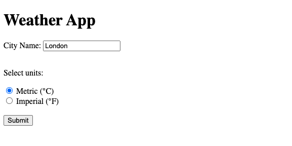
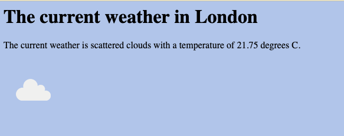

# Open Weather App

A simple app to get the weather of a city. This was a project from [Angela Yu's Complete 2023 Web Development Bootcamp](https://www.udemy.com/course/the-complete-web-development-bootcamp/).

The course itself is quite out of date despite the 2023 claim, but it's still a good introduction to web development. I've been using it to get a feel for the basics of HTML, CSS, and JavaScript.

## Getting started

1. Clone the repo
2. Install dependencies with `npm install`
3. Run `node app.js` to start the server
4. Run `open index.html` to open the app in your browser

## Example use

The home screen:

The results screen:

